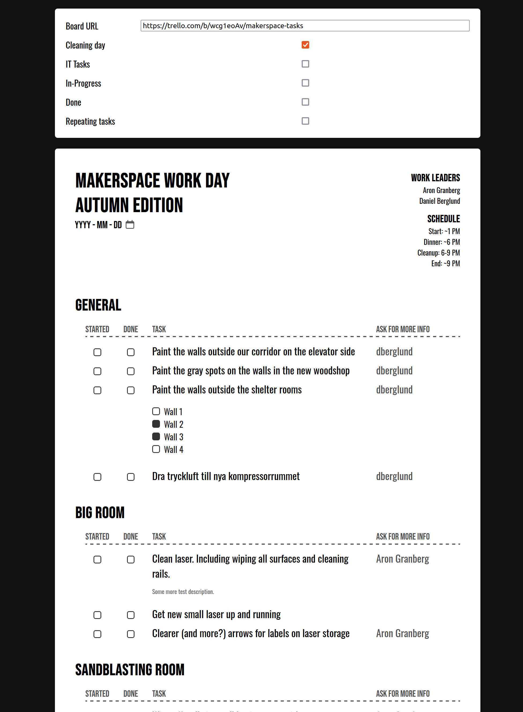

# Makerspace Task List

Takes a public Trello board and shows it as a nice list, suitable for printing on A4 paper.

This is used at Stockholm Makerspace for our work days, where members come together to improve the space.

The page header, date and extra text to the right, is editable directly in the browser.

At the top one can select both which board to use, and which lists from that board to include. These settings are hidden when printing.



## Usage

Development mode:

```bash
make watch
```

Production build:

```bash
make build
```